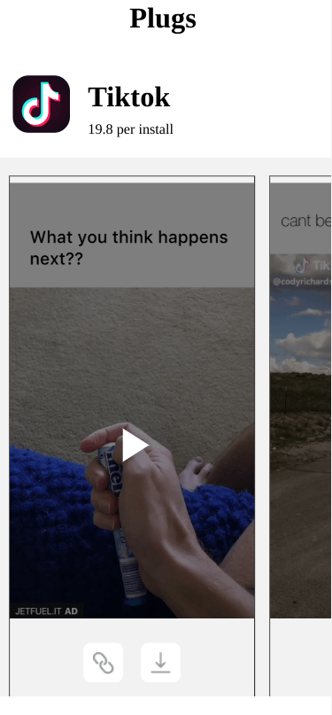
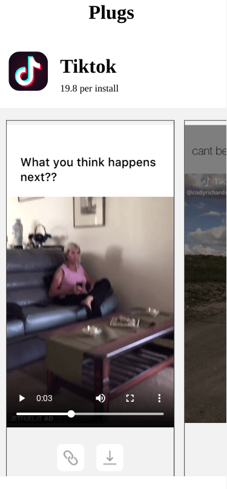
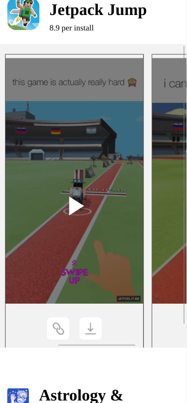

# JetFuel Take Home Exercise

This is my solution to this [repo](https://github.com/reallabs/react-take-home).

## Screenshots

***

***

***

## Instructions
This is a frontend exercise that will give you the chance to see what kind of things we build at JetFuel!

You will be building a simplified version of our main app, the Plug (www.plugco.in). This is the app through which our influencer access our offers, track their earnings, and manage their account. In particular, you will be recreating our main 'offer' feed:

We've spun up an endpoint on our server to return a sample feed of offers as a JSON blob. You can access that here:
https://www.plugco.in/public/take_home_sample_feed

Your job is set up a react project that calls the sample endpoint and renders feed based on the JSON data returned. 

You can find the design and an explanation of each component in this Figma file:
https://www.figma.com/file/1exs9yHG251QWdUy2YztUg/takehome_template_ios_01?node-id=0%3A1

Note - We're only providing mobile designs. For the sake of this exercise, there's no need to build this for desktop!

We have a starter app provided in the `./app` directory, please complete your project here.

We're giving you 3 hours to make as much progress on this project as possible. While we recognize it will be difficult to finish everything, part of the goal is to see how you prioritize, and how much you're able to get through.

### Bonus

- Can you handle failed API requests gracefully? Maybe redirect to a 'failed' UI state with a rety option? 
- Can you get the videos to play inline when the 'play' icon is tapped?
- What steps can you take to optimize the load time of cover photos? How about the scroll performance? 
- Can you add pull-to-refresh? 

## Thoughts 

- Adhered to the time limit of 3 hours
- Used SWR to streamline fetching 
- Used react-copy-to-clipboard for clipboard functionality
- With short time limit, you have to use other libraries versus building your own implemenation
- Used top-level preloading with swr 
- Saved response from the server in data.json
- Since no desktop view, limited body's max-width to 425px.

## Built with

- Typescript
- [Vite](https://vitejs.dev/)
- [SWR](https://swr.vercel.app/)
- [React-copy-to-clipboard](https://www.npmjs.com/package/react-copy-to-clipboard)

## Useful Resources

- [json2ts](http://json2ts.com/) - generate TypeScript interfaces from JSON
- [YouTube](https://www.youtube.com/watch?v=MC2fKmp_xcs) - SWR the data fetching hero of ReactJS // 5 minute tutorial
- [YouTube](https://www.youtube.com/watch?v=cNQTg920Nx0) - Skeleton Loading Components with Animation | React & CSS Examples
- [YouTube](https://www.youtube.com/watch?v=3yfswsnD2sw) - Create a horizontal media scroller with CSS
- [Codepen](https://codepen.io/kevinpowell/pen/ExbKBQa) - horizontal media scroller
- [Stack Overflow](https://stackoverflow.com/questions/24658365/img-tag-displays-wrong-orientation) - img tag displays wrong orientation
- [Stack Overflow](https://stackoverflow.com/questions/11620698/how-to-trigger-a-file-download-when-clicking-an-html-button-or-javascript) - trigger a file download when clicking an html button
- [Stack Overflow](https://stackoverflow.com/questions/50694881/how-to-download-file-in-react-js) - download file in react
- [YouTube](https://www.youtube.com/watch?v=cSyxLTPuA7o) - Download a media file from internet with react JS (axios) without redirecting to another page.
- [SWR Docs](https://swr.vercel.app/docs/prefetching) - prefetching